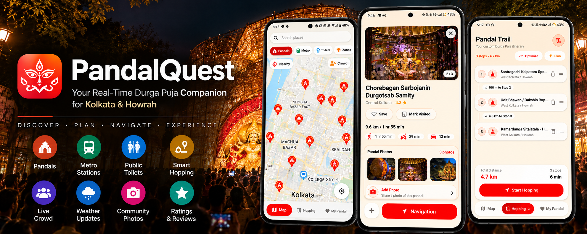
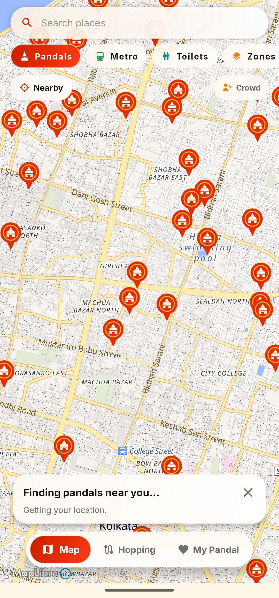
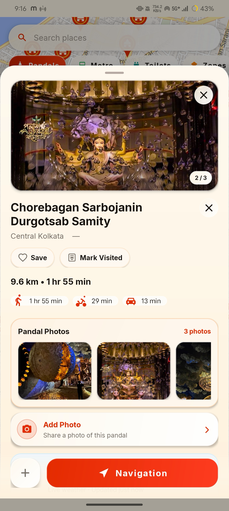
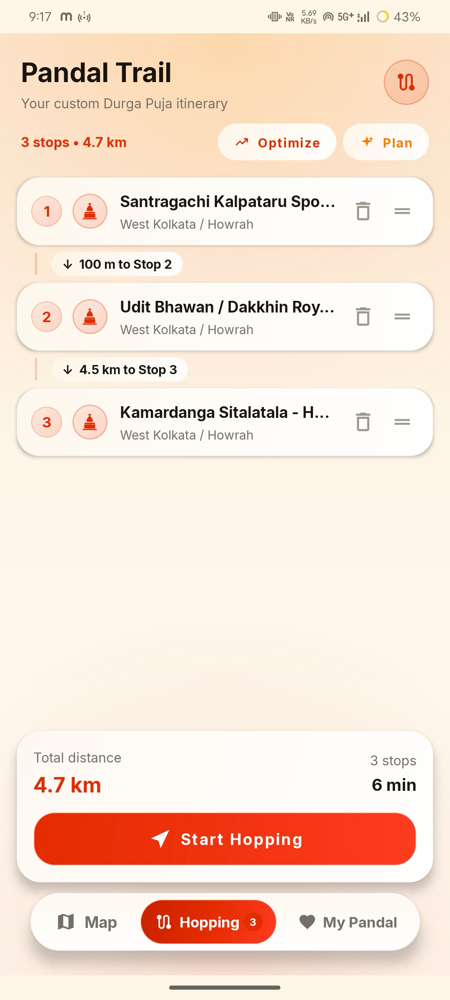
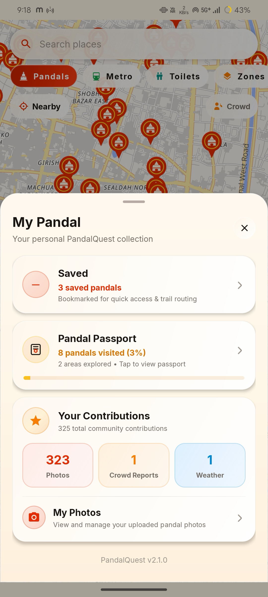

<div align="center">

# 🛕 PandalQuest

### Your Real-Time Durga Puja Companion for Kolkata

**Discover pandals. Find metro stations. Locate nearby toilets.  
Build your hopping route. Track crowd updates. Share photos. Navigate with ease.**

<br>

[](https://www.android.com/)
[](https://kotlinlang.org/)
[](https://firebase.google.com/)
[](https://mapsplatform.google.com/)
[](https://supabase.com/)
[](#-whats-new-in-v210)

<br>

> **Pandal hopping, rebuilt around live location, real routes and community data.**

<br>



<br>

### 🗺️ Discover &nbsp; • &nbsp; 🧠 Plan &nbsp; • &nbsp; 📍 Navigate &nbsp; • &nbsp; 👥 Contribute

</div>

---

## ✨ Why PandalQuest?

PandalQuest is a map-first Android application built for **Durga Puja pandal hopping across Kolkata and Howrah**.

Instead of switching between maps, search, notes, weather and community updates, PandalQuest brings the festival experience into one place.

| 🛕 Discover | 🗺️ Navigate | 🧠 Plan | 👥 Contribute |
|:---:|:---:|:---:|:---:|
| Find real pandals | Real road routes | Multi-stop hopping | Crowd reports |
| Metro discovery | Google Maps navigation | Road vs Metro decisions | Weather observations |
| Nearby toilets | Live GPS | Reorder stops | Ratings & photos |

---

# 📱 App Showcase

<div align="center">

| 🗺️ Festival Map | 🛕 Pandal Detail |
|:---:|:---:|
|  |  |

| 🧭 Hopping | ❤️ My Pandal |
|:---:|:---:|
|  |  |

</div>

> Put your real app screenshots in `docs/images/` using these filenames.

---

# 🧭 The PandalQuest Experience

## 01 — Discover

### 🗺️ One Festival Map

Explore Kolkata and Howrah through a live interactive map.

**Map layers**

- 🛕 Pandals
- 🚇 Metro stations
- 🚻 Public toilets
- 🟧 Festival zones where reliable data is available

### 🔎 Universal Search

Search across:

```text
Pandal names
Areas / localities
Metro stations
Public toilets
```

### 🎛️ Independent Filters

```text
[PANDALS]   [METRO]   [TOILETS]   [ZONES]
```

Filters can be combined without forcing unrelated markers onto the map.

---

## 02 — Explore

### 🛕 Everything You Need at a Pandal

| | |
|---|---|
| 📍 Location | 🚗 Road distance |
| 🚶 Walking route | 🏍️ Two-wheeler route |
| 🌦️ Weather | 👥 Crowd level |
| 🚇 Nearest metro | ⭐ Community rating |
| 📸 Community photos | ❤️ Saved status |
| 🛂 Pandal Passport | 🧭 Navigation |
| ➕ Add to Hopping | |

---

## 03 — Plan

# 🧠 Smart Hopping

Build a personalized festival itinerary containing:

```text
Pandal
   ↓
Metro Station
   ↓
Public Toilet
   ↓
Pandal
   ↓
Pandal
```

### Auto Plan

PandalQuest compares the **complete journey**, not just individual transport distances.

```text
                    📍 DEVICE GPS
                         │
                 ┌───────┴───────┐
                 │               │
                 ▼               ▼
          🚗 Direct Route   🚇 Metro Route
                 │               │
                 │        Walk + Metro + Wait
                 │          + Transfer + Walk
                 │               │
                 └───────┬───────┘
                         ▼
                  Compare Journey
                       Times
                         │
                         ▼
                  Choose Better Route
```

Metro is considered only when the complete journey provides a meaningful advantage.

### Hopping Controls

- Add places
- Remove places
- Reorder stops
- Prevent duplicate stops
- Calculate route information
- Start navigation
- Persist the itinerary across app restarts

---

# 🚗 Real Routing

PandalQuest uses a resilient multi-provider routing pipeline.

```text
                    📍 DEVICE GPS
                         │
                         ▼
              ┌─────────────────────┐
              │   Google Routes API │
              │       PRIMARY       │
              └──────────┬──────────┘
                         │
                    Route success?
                    /           \
                  YES            NO
                   │              │
                   ▼              ▼
             Google Route    OpenRouteService
                                HeiGIT
                                  │
                             Route success?
                              /         \
                            YES          NO
                             │            │
                             ▼            ▼
                       Real Route     Route
                         Result     Unavailable
```

| Mode | Google | OpenRouteService |
|---|---|---|
| 🚗 Driving | `DRIVE` | `driving-car` |
| 🚶 Walking | `WALK` | `foot-walking` |
| 🏍️ Two-wheeler / Cycling | `TWO_WHEELER` | `cycling-regular` |

> **No fabricated distances.** If both routing providers fail, the UI shows `Route unavailable`.

---

# 👥 Community Layer

PandalQuest becomes more useful as visitors contribute.

```text
                         PANDALQUEST
                              │
              ┌───────────────┼───────────────┐
              ▼               ▼               ▼
          🛕 PANDAL        📍 LOCATION      👥 COMMUNITY
                                              │
                                    ┌─────────┼─────────┐
                                    ▼         ▼         ▼
                                  Crowd    Weather   Rating
                                    │         │         │
                                    └─────────┼─────────┘
                                              ▼
                                         📸 Photos
```

## 👥 Crowd Reports

Visitors can report crowd intensity from **1–10**.

| Level | Meaning |
|:---:|---|
| `1–2` | Empty |
| `3–4` | Light |
| `5–6` | Moderate |
| `7–8` | Very busy |
| `9` | Extremely busy |
| `10` | Packed |

## 🌦️ Weather Observations

```text
No rain
Drizzle
Raining
Heavy rain
```

Community observations represent local conditions and become stale after the configured validity period.

## ⭐ Community Ratings

PandalQuest includes community ratings for individual pandals.

Users can submit a **1–5 star rating**, while the Pandal Detail screen displays the community average.

```text
Kolkata     4 ⭐
```

The rating is separate from Google Maps.

---

# 📸 Community Pandal Photos

```text
Pandal Detail
      │
      ▼
  Add Photo
      │
      ▼
Camera / Gallery
      │
      ▼
   Preview
      │
      ▼
   Upload
      │
      ├───────────────┐
      ▼               ▼
 Supabase         Firestore
 Storage          Metadata
      │               │
      └───────┬───────┘
              ▼
       Community Gallery
```

Photo metadata includes:

```text
pandalId
storagePath
downloadUrl
uploadedBy
createdAt
status
```

---

# 🚇 Metro Discovery

Tap a metro station to view:

- Station name
- Distance from current location
- Add/remove from Hopping
- Navigation

Metro stations participate in the smart hopping planner as **transport legs rather than ordinary pandal stops**.

---

# 🚻 Nearby Toilets

Public toilets are discovered through **Google Places**.

Each toilet can provide:

- Restroom name
- Address
- Current distance
- Add/remove from Hopping
- Navigation

PandalQuest is designed to use real place data instead of fabricated toilet coordinates.

---

# 📍 Live Location

Device GPS powers:

```text
Nearby discovery
      ↓
Distance calculations
      ↓
Route origins
      ↓
Metro distance
      ↓
Toilet distance
      ↓
Contribution eligibility
      ↓
Navigation
```

---

# 🎨 Design System

PandalQuest's visual identity is inspired by **Durga Puja, Kolkata and modern glass-based interfaces**.

| Color | Hex |
|:---|:---:|
| 🔴 Sindoor Red | `#E52B00` |
| 🤍 Cream | `#FFF5E3` |
| 🟠 Orange | `#F97E04` |
| 🟡 Gold | `#FBC222` |
| 🟨 Festival Yellow | `#FBEF00` |
| 🟢 Green | `#45A701` |

**Visual language:** warm festival palette · Liquid Glass surfaces · floating map controls · rounded cards · strong typography · map-first navigation

---

# 🏗️ Architecture

```text
                         PANDALQUEST
                              │
                              ▼
                       ┌────────────┐
                       │    MAP     │
                       └─────┬──────┘
                             │
              ┌──────────────┼──────────────┐
              ▼              ▼              ▼
           PANDALS         METRO         TOILETS
              │              │              │
              └──────────────┼──────────────┘
                             ▼
                        PLACE DETAIL
                             │
                 ┌───────────┼───────────┐
                 ▼           ▼           ▼
              ROUTING     HOPPING    COMMUNITY
                 │           │           │
                 ▼           ▼           ▼
             MAPS /       MULTI-STOP   CROWD
             ROUTES         PLAN       WEATHER
                                         RATING
                                         PHOTOS
```

---

# 🧰 Tech Stack

### Android
Kotlin · Android SDK · Gradle · Google Play Services Location

### Maps & Location
Google Maps Platform · Google Routes API · Google Places API (New) · Google Maps navigation · Device GPS · MapLibre / OpenStreetMap where applicable

### Backend & Community
Firebase Authentication · Cloud Firestore · Firebase Security Rules · Supabase Storage · Realtime listeners

### Routing
Google Routes API · OpenRouteService / HeiGIT fallback

---

# 🚀 What's New in v2.1.0

### 🧠 Smarter Auto Plan
- Complete journey-time comparison
- Road vs Metro evaluation
- 5-minute minimum metro advantage threshold
- Detour protection
- Metro treated as a transport leg

### 🚗 Better Routing
- Google Routes primary provider
- OpenRouteService / HeiGIT fallback
- Walking, cycling and driving routes
- Short-term caching
- Route-unavailable state instead of fabricated distances

### 🚻 Nearby Toilets
- Google Places discovery
- Real nearby public toilet locations
- Toilet detail cards
- Navigation
- Hopping integration

### 👥 Community
- Crowd reports
- Weather observations
- Community ratings
- Pandal photos
- Firebase synchronization

### 🧭 Hopping
- Multi-stop itinerary
- Mixed pandal / metro / toilet stops
- Reordering
- Duplicate-stop prevention
- Persistent itinerary

---

# 📊 Feature Matrix

| Feature | Status |
|:---|:---:|
| Live GPS | ✅ |
| Interactive Festival Map | ✅ |
| Pandal Discovery & Search | ✅ |
| Metro Discovery | ✅ |
| Universal Search | ✅ |
| Independent Map Filters | ✅ |
| Google Routes | ✅ |
| OpenRouteService Fallback | ✅ |
| Walking / Cycling / Driving Routes | ✅ |
| Google Maps Navigation | ✅ |
| Automatic & Community Weather | ✅ |
| Community Crowd Reports | ✅ |
| Community Ratings | ✅ |
| Community Photos | ✅ |
| Google Places Toilets | ✅ |
| Hopping Itinerary | ✅ |
| Mixed Pandal / Metro / Toilet Routes | ✅ |
| Saved Pandals | ✅ |
| Pandal Passport | ✅ |
| My Pandal | ✅ |
| Offline Core Map | 🚧 |
| Festival Event Timings | 🚧 |
| Advanced Accessibility Data | 🚧 |

---

# 📦 Setup

## Requirements

- Android SDK
- JDK
- Gradle wrapper
- Android device or emulator
- USB debugging for physical-device testing
- Google Cloud project
- Firebase project

## Google Maps Platform

Required services:

```text
Maps SDK for Android
Routes API
Places API (New)
```

Configure API-key restrictions according to the actual request architecture.

> **Never commit production API keys to GitHub.**

Use local configuration such as:

```text
local.properties
secrets.properties
```

## Firebase

Enable the required services:

```text
Firebase Authentication
Cloud Firestore
Firebase Security Rules
```

---

# 🛠️ Development

### Build

```bash
./gradlew assembleDebug
```

### Install

```bash
adb install -r app/build/outputs/apk/debug/app-debug.apk
```

### Devices

```bash
adb devices
```

### Launch

```bash
adb shell am start -n com.pandalfinder/.MainActivity
```

### Logs

```bash
adb logcat
```

---

# 🧪 Real Device Testing

Real-device testing is recommended for GPS, Maps, Routes, Places, camera/photo picker, Firebase synchronization, Google Maps navigation and location permissions.

---

# 🗺️ Roadmap

- [ ] Festival / event timing information
- [ ] More detailed accessibility information
- [ ] Offline map / core data support
- [ ] More community-generated festival information
- [ ] Better photo moderation
- [ ] Richer pandal information
- [ ] Verified festival details

---

# 🤝 Contributing

```bash
git checkout -b feature/your-feature
git add .
git commit -m "Add your feature"
git push origin feature/your-feature
```

Then open a pull request with a clear description of the change.

---


<div align="center">

# 🛕 PandalQuest

### Discover Kolkata. Build your route. Experience Durga Puja.

<br>

**Made for pandal hoppers.**

<br>

**v2.1.0**

<br>

<sub>Built with Kotlin • Maps • Firebase • Supabase • Community Data</sub>

</div>
