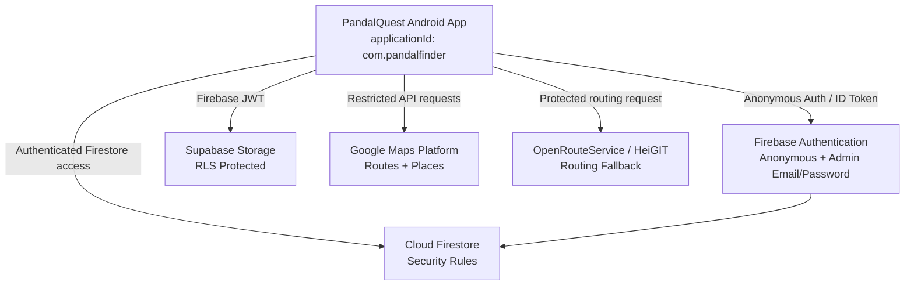

# PandalQuest Security Architecture

> Security, privacy and authorization architecture for PandalQuest.


---

## Security at a Glance

| Area | Protection |
| :--- | :--- |
| **Normal users** | Firebase Anonymous Auth |
| **Admins** | Firebase Email/Password + Firestore allowlist |
| **Database** | Firestore Security Rules |
| **Photos** | Supabase Storage RLS |
| **API keys** | Restricted Android keys (`com.pandalfinder` + SHA-1) |
| **Location** | Foreground/on-device use |
| **Background tracking** | Not used |
| **Community ownership** | UID-based ownership |
| **Admin writes** | Server-side allowlist (`/admins/{uid}`) |

---

## 1. System Architecture

PandalQuest combines Firebase, Supabase, Google Maps Platform, and OpenRouteService into a zero-login, privacy-first Android client application.



> [!NOTE]
> **Product Name vs. Android Application ID**:  
> The user-facing product is **PandalQuest**. The internal Android package identifier remains **`com.pandalfinder`** across `AndroidManifest.xml`, `build.gradle.kts`, Firebase configuration, and Google API Key restrictions. This guarantees backwards compatibility with existing backend resources.

---

## 2. Authentication

### Normal Users (Zero-Friction Anonymous Auth)
- **Silent Initialization:** Regular users are authenticated anonymously in the background via `FirebaseAuth.getInstance().signInAnonymously()`.
- **Zero Barrier:** No registration screens, passwords, phone numbers, or third-party OAuth prompts are required.
- **Cryptographic User Identity:** Every community write (photos, crowd updates, weather reports, pandal ratings) is securely bound to the authenticated Firebase UID (`request.auth.uid`). Client applications cannot forge arbitrary user identities.
- **In-Memory Token Handling:** Auth tokens are maintained in-memory by the Firebase SDK and never stored in plain text or logged to Logcat.

```
Anonymous User
      │
      ▼
Firebase Auth
      │
      ▼
request.auth.uid
      │
      ├── Photos (/pandalPhotos)
      ├── Crowd Reports (/crowdReports)
      ├── Weather Reports (/weatherReports)
      └── Ratings (/pandalRatings)
```

> **Community writes are bound to the authenticated Firebase UID.**

### Administrators (Firebase Email & Password)
- **Separate Authentication Channel:** Administrators sign in using dedicated email and password credentials managed by Firebase Authentication.
- **No Hardcoded Credentials:** No admin passwords, emails, secret tokens, or hashes reside in the mobile source code, `BuildConfig`, or resource files.
- **Generic Feedback:** Authentication failures use generic messaging to mitigate email enumeration vectors.
- **Automatic Demotion / Revocation:** If an authenticated email user lacks an active record on the server-side Firestore admin allowlist, their session is cleared and the client automatically switches back to an anonymous session.

---

## 3. Admin Authorization

Administrative authorization follows a strict server-side allowlist model.

```
Admin Login
    ↓
Firebase Email/Password
    ↓
Firebase UID
    ↓
/admins/{uid}
    ↓
role == "admin"
AND
enabled == true
    ↓
Admin privileges
```

- **Server-Side Trust Anchor:** Admin privileges are strictly derived from the Firestore collection `/admins/{firebaseUid}`:
  ```json
  {
    "role": "admin",
    "enabled": true
  }
  ```
- **Client Write Prohibition:** The `/admins` collection has `allow write: if false;` in Firestore Security Rules. No mobile client can create, modify, delete, or promote an admin account.
- **Zero Client Trust:** Client-side flags (`isAdmin`, Intent extras, SharedPreferences) are never trusted for authorization decisions.

---

## 4. Photo Ownership

Every community photo metadata record in Firestore and storage object in Supabase has exactly **one owner**: the Firebase UID of the uploading user (`uploadedBy = request.auth.uid`).

| Role | View Photo | Upload Photo | Replace Own | Delete Own | Edit/Delete Others |
| :--- | :---: | :---: | :---: | :---: | :---: |
| **Owner (User A)** | ✅ Allow | ✅ Allow | ✅ Allow | ✅ Allow | ❌ Denied |
| **Other User (User B)** | ✅ Allow | ✅ Allow | ❌ Denied | ❌ Denied | ❌ Denied |
| **Authorized Admin** | ✅ Allow | ✅ Allow | ✅ Allow | ✅ Allow | ✅ Allow |

### Ownership Immutability
Photo ownership cannot be transferred or reassigned. Firestore Security Rules enforce `request.resource.data.uploadedBy == resource.data.uploadedBy` on every update operation.

---

## 5. Firestore Security

All database access is governed by server-side [firestore.rules](./firestore.rules).

### Core Enforcement Highlights:
1. **Authenticated Writes:** Write operations require a valid `request.auth.uid`.
2. **UID Ownership:** Community records (photos, ratings, reports) enforce that the document's author field matches `request.auth.uid`.
3. **Immutable Photo Ownership:** Prevents modifying the original creator's UID.
4. **Valid Crowd Levels:** Enforces integer crowd levels strictly between `1` and `10`.
5. **Valid Weather Conditions:** Restricts conditions to `NO_RAIN`, `DRIZZLE`, `RAINING`, and `HEAVY_RAIN`.
6. **Community Ratings Validation:** Restricts pandal star ratings strictly to integers between `1` and `5`.
7. **Admin-Only Moderation:** Updating or deleting other users' crowd reports, weather submissions, or pandal photos requires an active admin allowlist record.
8. **Deny-by-Default Fallback:** All unspecified collections and documents reject both read and write operations.

```firestore
rules_version = '2';
service cloud.firestore {
  match /databases/{database}/documents {
    
    function isAdmin() {
      return request.auth != null
        && exists(/databases/$(database)/documents/admins/$(request.auth.uid))
        && get(/databases/$(database)/documents/admins/$(request.auth.uid)).data.role == 'admin'
        && get(/databases/$(database)/documents/admins/$(request.auth.uid)).data.enabled == true;
    }

    match /admins/{adminId} {
      allow read: if request.auth != null && (request.auth.uid == adminId || isAdmin());
      allow write: if false;
    }

    match /pandalPhotos/{photoId} {
      allow read: if true;
      allow create: if request.auth != null
                    && request.resource.data.uploadedBy == request.auth.uid
                    && request.resource.data.status in ['active', 'hidden', 'flagged']
                    && request.resource.data.storagePath is string
                    && request.resource.data.downloadUrl.size() > 0
                    && request.resource.data.pandalId.size() > 0;
      allow update: if request.auth != null && (
                      (resource.data.uploadedBy == request.auth.uid
                       && request.resource.data.uploadedBy == resource.data.uploadedBy
                       && request.resource.data.pandalId == resource.data.pandalId
                       && request.resource.data.id == resource.data.id)
                      || isAdmin()
                    );
      allow delete: if (request.auth != null && resource.data.uploadedBy == request.auth.uid) || isAdmin();
    }

    match /crowdReports/{reportId} {
      allow read: if true;
      allow create: if request.auth != null
                    && request.resource.data.userId == request.auth.uid
                    && request.resource.data.pandalId.size() > 0
                    && ((request.resource.data.level is int && request.resource.data.level >= 1 && request.resource.data.level <= 10)
                        || (request.resource.data.crowdLevel is int && request.resource.data.crowdLevel >= 1 && request.resource.data.crowdLevel <= 10));
      allow update, delete: if isAdmin();
    }

    match /weatherReports/{reportId} {
      allow read: if true;
      allow create: if request.auth != null
                    && (request.resource.data.userId == request.auth.uid || request.resource.data.reportedBy == request.auth.uid)
                    && request.resource.data.pandalId.size() > 0
                    && (request.resource.data.weatherStatus in ['NO_RAIN', 'DRIZZLE', 'RAINING', 'HEAVY_RAIN']
                        || request.resource.data.condition in ['NO_RAIN', 'DRIZZLE', 'RAINING', 'HEAVY_RAIN']
                        || request.resource.data.weatherCondition in ['NO_RAIN', 'DRIZZLE', 'RAINING', 'HEAVY_RAIN']);
      allow update, delete: if isAdmin();
    }

    match /pandalRatings/{ratingId} {
      allow read: if true;
      allow create: if request.auth != null
                    && request.resource.data.userId == request.auth.uid
                    && request.resource.data.pandalId.size() > 0
                    && request.resource.data.rating is int
                    && request.resource.data.rating >= 1
                    && request.resource.data.rating <= 5;
      allow update: if request.auth != null
                    && ((resource.data.userId == request.auth.uid
                         && request.resource.data.userId == request.auth.uid
                         && request.resource.data.pandalId == resource.data.pandalId
                         && request.resource.data.rating is int
                         && request.resource.data.rating >= 1
                         && request.resource.data.rating <= 5)
                        || isAdmin());
      allow delete: if (request.auth != null && resource.data.userId == request.auth.uid) || isAdmin();
    }

    // Deny-by-default for all other document paths
    match /{document=**} {
      allow read, write: if false;
    }
  }
}
```

---

## 6. Supabase Storage Security

Supabase Storage manages community photos using Row Level Security (RLS) configured in [supabase_security_setup.sql](./supabase_security_setup.sql).

- **Bucket:** `pandal-photos`
- **Object Path Hierarchy:** `{firebaseUid}/{pandalId}/{photoId}.jpg`

```
Firebase UID
     ↓
Storage object path
     ↓
Supabase RLS
     ↓
Owner-only mutation
```

### Policy Rules:
- **SELECT Policy:** Public read access on bucket `pandal-photos`.
- **INSERT Policy:** Authenticated user where `(storage.foldername(name))[1] = auth.jwt() ->> 'sub'` OR admin.
- **UPDATE / DELETE Policy:** Object owner where `(storage.foldername(name))[1] = auth.jwt() ->> 'sub'` OR admin.
- **Public Write Prohibition:** Unauthenticated uploads, modifications, and deletions are strictly rejected.

---

## 7. Location & Community Contribution Security

- **Client-Side Proximity Validation:** When a user initiates a crowd update, the Android app computes the distance between the device's current GPS location and the pandal coordinates (`Location.distanceTo`). If the distance exceeds 500 meters, the contribution dialog does not open.
- **Architectural Scope:** The 500m contribution proximity check is client-side. In a Firebase Spark/serverless architecture without a trusted server-side location verifier, rooted or mock-location devices could potentially bypass this check.
- **Backend Defense:** The backend strictly validates data types, authenticated UID attribution, active pandal ID references, enum constraints, and valid ranges (e.g., 1–10 crowd levels, 1–5 ratings), preventing arbitrary schema corruption.

---

## 8. Google API Key Security

Google Maps Platform credentials are configured with explicit app restrictions in the Google Cloud Console:

- **API Restrictions:**
  - Google Routes API
  - Google Places API (New)
- **Application Restriction:**
  - Android Application Package Name: `com.pandalfinder`
  - Certificate SHA-1 Fingerprint: `4F4C1806D054E172BF09FB0760599707D9BCFB5E`
- **Integrity Headers:** Outgoing REST requests to Google APIs include `X-Android-Package` and `X-Android-Cert` headers matching the authorized application signing certificate.

> [!NOTE]
> `com.pandalfinder` is the internal Android `applicationId` and package name. It is intentionally retained for Google Cloud and Firebase certificate binding even though the user-facing product name is **PandalQuest**.

---

## 9. Secrets Management

- **Repository Hygiene:** Configuration files containing keys (`secrets.properties`, `local.properties`) are excluded from version control via `.gitignore`.
- **Client-Facing Keys:** The Android application bundles only publishable/client-facing keys (`SUPABASE_PUBLISHABLE_KEY`, restricted `GOOGLE_ROUTES_API_KEY`, and `ORS_API_KEY`).
- **No Privileged Server Keys:** Supabase `service_role` keys, Firebase service account credentials, and database master passwords are **never** bundled in client APKs or committed to source control.

---

## 10. Privacy & Location Handling

PandalQuest is engineered around privacy-first principles for devotees exploring Kolkata's Durga Puja.

| Data | Purpose | Persistent server tracking? |
| :--- | :--- | :--- |
| **Device location** | Nearby pandal discovery & routing | **No** (ephemeral on-device use only) |
| **Photos** | Community pandal gallery | **Yes** (uploaded voluntarily by user) |
| **Crowd report** | Real-time crowd information | **Yes** (attributed to anonymous UID) |
| **Weather report** | Real-time rain information | **Yes** (attributed to anonymous UID) |
| **Anonymous UID** | Contribution ownership & rate integrity | **Yes** (managed by Firebase Auth) |
| **Admin credentials** | Admin authentication | **Yes** (managed by Firebase Auth) |

- **No Continuous Telemetry:** PandalQuest does not run background location services, persistent tracking workers, or continuous location telemetry.
- **Photo Upload Privacy:** Community photo submissions do not require location permissions.

---

## 11. Admin Bootstrap

To grant administrative access to an authorized maintainer:

### A. Firebase Console
1. Navigate to **Firebase Console $\rightarrow$ Authentication $\rightarrow$ Users**.
2. Click **Add User**, enter the admin email and a secure password.
3. Copy the generated **Firebase User UID** (e.g. `pX9qZ...`).
4. Navigate to **Cloud Firestore $\rightarrow$ Data**.
5. Create a document in collection `admins` with Document ID = `<ADMIN_FIREBASE_UID>`:
   ```json
   {
     "role": "admin",
     "enabled": true,
     "createdAt": 1727670000000
   }
   ```

### B. Supabase Dashboard (Optional if Supabase Storage Admin Moderation is configured)
1. Open the **Supabase SQL Editor**.
2. Run:
   ```sql
   INSERT INTO public.admin_users (firebase_uid, role, enabled)
   VALUES ('<ADMIN_FIREBASE_UID>', 'admin', true)
   ON CONFLICT (firebase_uid) DO UPDATE SET enabled = true, role = 'admin';
   ```

---

## 12. Security Verification

Automated security verification tests are implemented in [AdminAndSecurityTest.kt](app/src/test/java/com/pandalfinder/AdminAndSecurityTest.kt):

| Test | Purpose |
| :--- | :--- |
| **Photo ownership** | Prevent cross-user photo deletion or modification |
| **Ownership immutability** | Prevent `uploadedBy` UID reassignment on photo updates |
| **Admin privileges** | Verify admin authorization for moderation and deletion |
| **Storage path validation** | Enforce path structure and prevent path traversal (`../`) |
| **Crowd validation** | Enforce allowed crowd levels strictly between 1 and 10 |
| **Weather validation** | Enforce allowed weather condition enum values |
| **Admin authorization** | Verify server-side allowlist truth matrix (`role == 'admin'`, `enabled == true`) |

---

## 13. Known Limitations

> [!WARNING]
> **Security Boundaries & Architectural Limitations**
> 
> 1. **Client-Side GPS Spoofing:** Because PandalQuest operates on a serverless architecture without dedicated backend location compute, the 500m proximity check is enforced on-device. Rooted devices or mock location tools can spoof coordinates.
> 2. **Firebase Spark Resource Model:** In a serverless architecture without Cloud Functions, trusted server-side validation is limited to Firestore rules and Supabase RLS.
> 3. **Extractable Client API Keys:** Client API keys bundled in Android APKs can be extracted via reverse engineering; protection relies on Google Cloud package/SHA-1 restrictions and Supabase RLS.
> 4. **Key Rotation Requirement:** If signing keystores or client credentials are ever compromised, immediate rotation in Google Cloud Console and Supabase Dashboard is required.

---

## 14. Responsible Disclosure

If you discover a security vulnerability in PandalQuest, please avoid publicly disclosing exploitable details before the issue can be investigated and addressed.

- **Private Reporting:** Report security issues privately to the repository maintainers.
- **Confidentiality:** Do not include live production credentials, API secrets, private user data, or exploitable payloads in public GitHub issues or discussions.
